# Getting Started

## Overview
* Keycloak version: 20.0

## Useful links
* [Setting up keycloack with spring boot](https://www.baeldung.com/spring-boot-keycloak)
* [Secure Spring Boot + Angular 9 Application using KeyCloak(1/3)](https://medium.com/@kamleshbadgujar00/secure-spring-boot-angular-9-application-using-keycloak-1-3-b00e801ba693)
  * [Github - Backend (Spring Boot)](https://github.com/kamleshbadgujar/heroes-backend)
  * [Github - Frontend (Angular)](https://github.com/kamleshbadgujar/heroes-app)

# Tutorial

## 1. Deploying Keycloak + Postgres with Docker
> Remember to create database in postgres for Keycloak. By default, docker compose creates database for Spring Boot only. To do this purpose you can use `pgadmin`.

*docker-compose.yml*
```yaml
version: "3.8"
services:

  postgresql:
    container_name: postgres
    image: postgres:14.4
    restart: always
    ports:
      - "5432:5432"   # External port access for the development profile
    environment:
      POSTGRES_PASSWORD: admin
      POSTGRES_USER: admin
      POSTGRES_DB: ewizitingDB

  pgadmin:
    container_name: pgadmin
    image: dpage/pgadmin4:latest
    restart: always
    ports:
      - "81:80"
    environment:
      PGADMIN_DEFAULT_EMAIL: admin@admin.com
      PGADMIN_DEFAULT_PASSWORD: admin

  keycloak:
    image: quay.io/keycloak/keycloak:20.0.0
    environment:
      KC_DB: postgres
      KC_DB_URL: jdbc:postgresql://postgresql:5432/keycloak
      KC_DB_USERNAME: admin
      KC_DB_PASSWORD: admin
      KEYCLOAK_ADMIN: admin
      KEYCLOAK_ADMIN_PASSWORD: admin
      # Uncomment the line below if you want to specify JDBC parameters. The parameter below is just an example, and it shouldn't be used in production without knowledge. It is highly recommended that you read the PostgreSQL JDBC driver documentation in order to use it.
      #JDBC_PARAMS: "ssl=true"
    ports:
      - "8081:8081"
    command: [ "start-dev", "--http-port=8081" ]
    depends_on:
      - postgresql
```
Start docker with `docker compose up`.

## 2. Keycloak - configuration
> Remember to create database in postgres for Keycloak. By default, docker compose creates database for Spring Boot only. To do this purpose you can use `pgadmin`.

### 2.1. Creating a realm
Realm is a separate "container" for our application. It contains set of users, clients and global roles.<br/>
We can say **realm** represents our application infrastructure, which can have multiple **clients (e.g. backend and frontend)**.

1. Go to http://localhost:8081 -> administrator console and login with username and password: `admin`
2. Click upper top corner to create new realm. By default, you will only see `master` (ignore my `hospital-app` realm). 
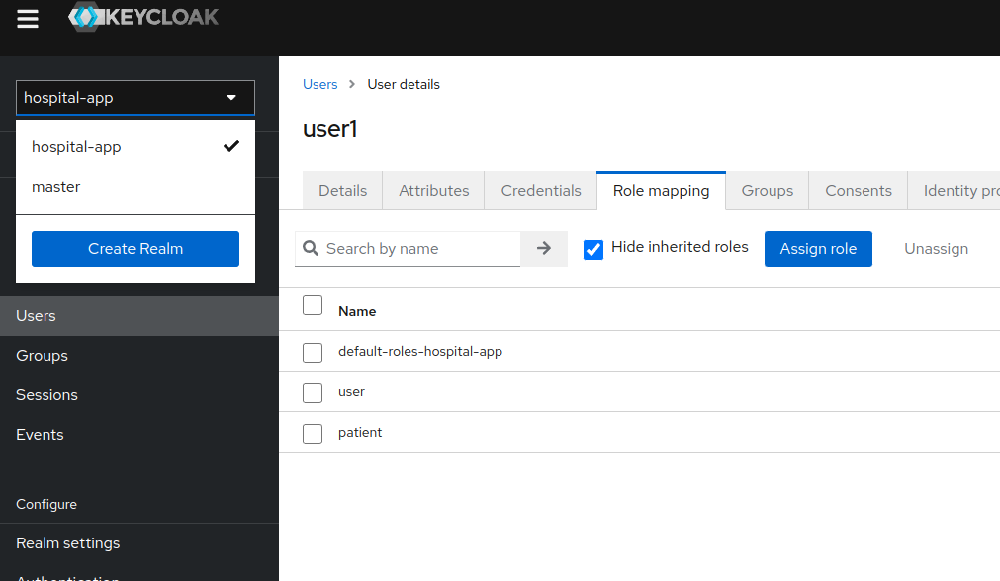
3. Let's add new realm and call it `test-app`. After clicking the `Create` button, a new realm will be created.<br/>
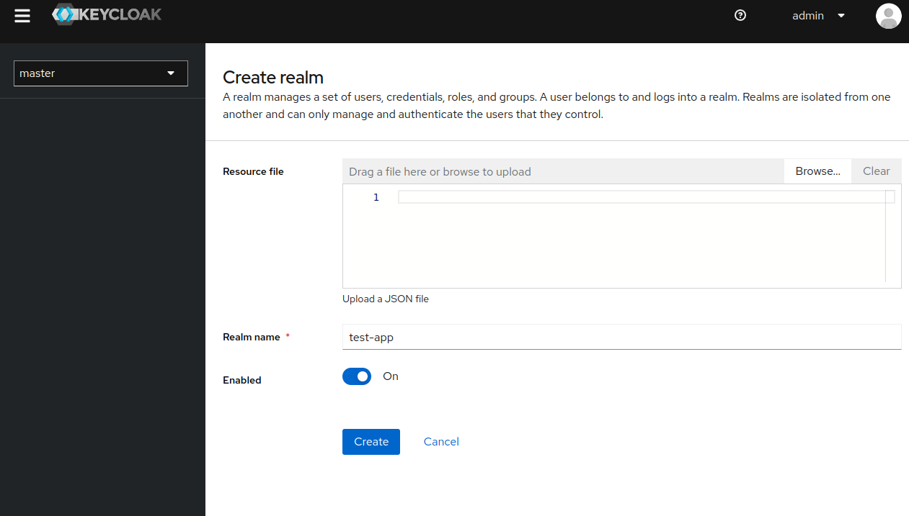
4. **Remember to perform all the operations in this new realm.**<br/>

### 2.2. Creating a client for backend (Spring Boot)
**Client** is a thing that will access data from our **realm**. For example a client can be **backend - Spring Boot** and/or **frontened - Angular**.

1. Go to `Clients -> Create client`<br/>

2. As we want to create a client for Spring Boot, populate `Client ID` with `backend` and smash next.<br/>
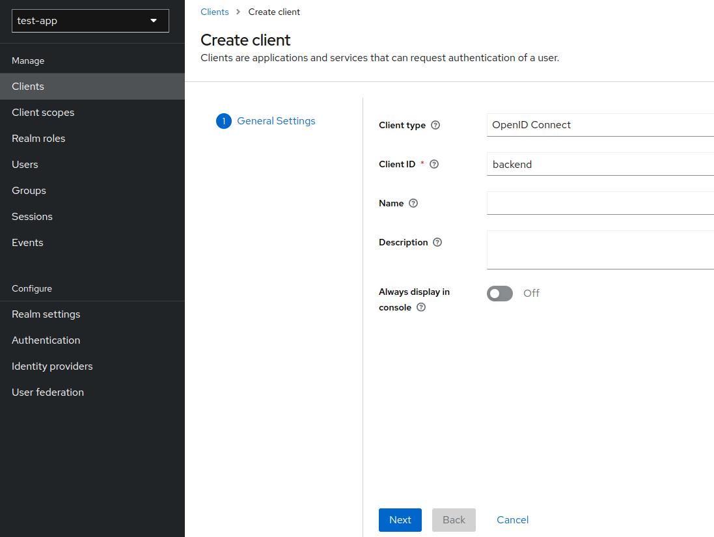
3. Select `Standard flow` and `Direct access grants`, because Spring Boot backend service **will only verify bearer token, it will never initiate the login**. Click save.<br/>
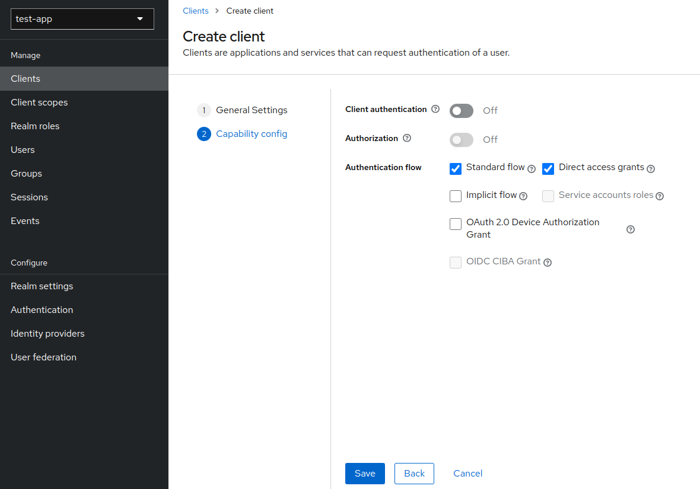
4. Now go to `Clients` and select our newly created `backend` client.<br/>
Find `Valid redirect URIs` and type `http://localhost:8080/*` (the Spring Boot url - remember to add `*`) and save.<br/>
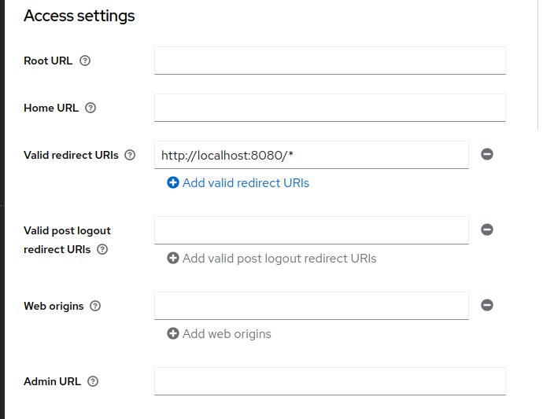

### 2.3. Creating a client for frontend (Angular)
1. Go to `Clients -> Create client`<br/>
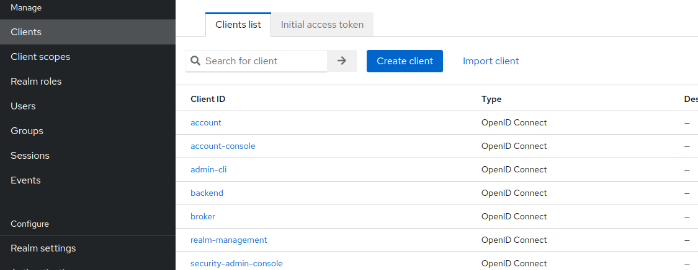
2. Fill in `Client ID` with `frontend`. Next.<br/>
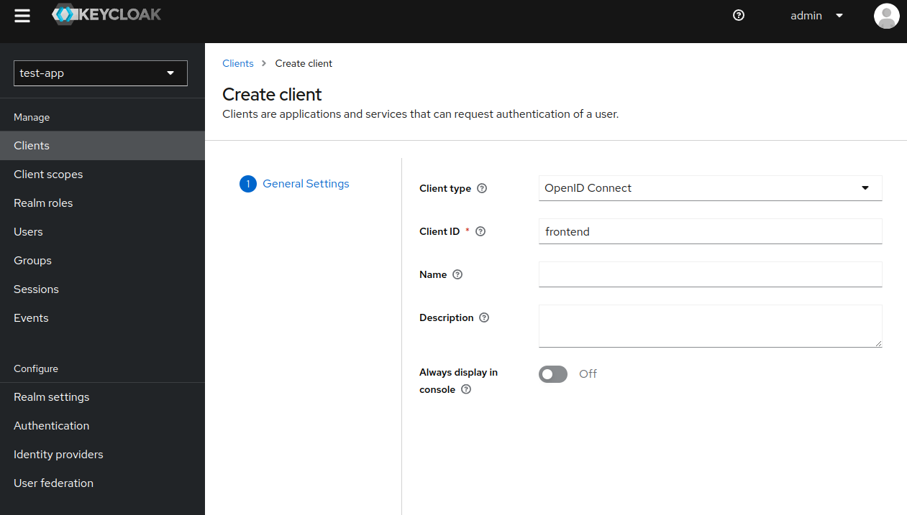
3. Select `Standard flow`, `Direct access grants` and `Implicit flow`. <br/>
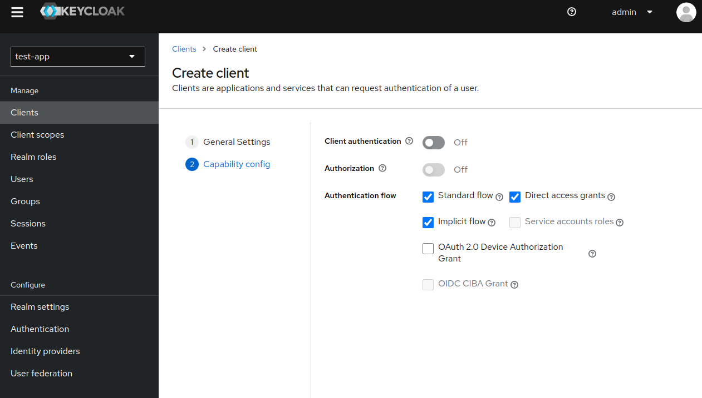
4. Now go to `Clients` and select our newly created `frontend` client.<br/>
Fill in `Valid redirect URIs` and `Valid post logout redirect URIs` with URIs you redirect after login/logout on frontend e.g. I used my local ip address. 
Fill in `Web origins` with `*` and save.<br/>
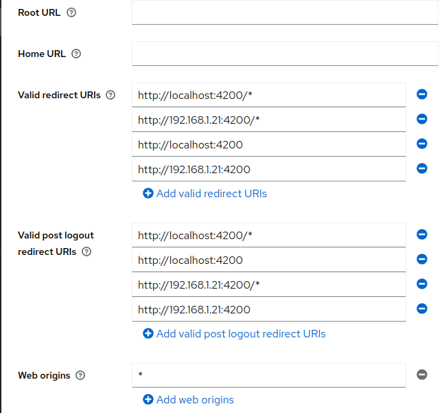

### 2.4. Creating `Roles`
We have 2 types of roles. Global (for every client) called `Realm roles`, and local `Client roles` available only for specific client.
In the tutorial we use only global roles - `Realm roles`.

1. Go to `Realm roles -> Create role` <br/>
2. Our role will be `user` <br/>
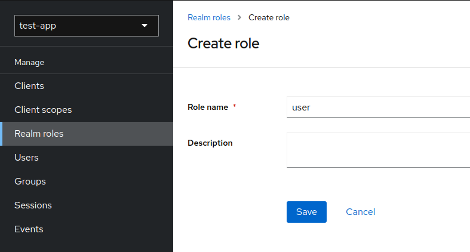

### 2.5. Enabling Registration
1. Go to `Realm settings -> Login`<br/>
2. Check `User registration` and `Email as username`<br/>
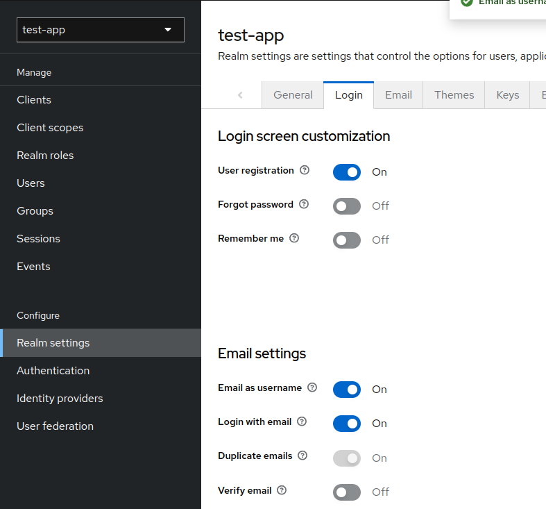

### 2.6. Making role to be added by default for every registered user
1. Go to `Realm settings -> User registration`<br/>
2. Click `Assign role`<br/>
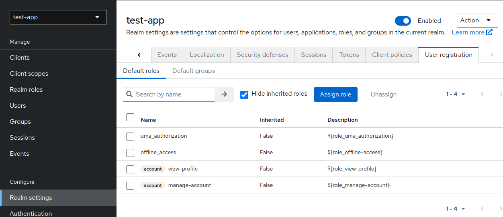
3. Choose our role `user` and click `Assign`
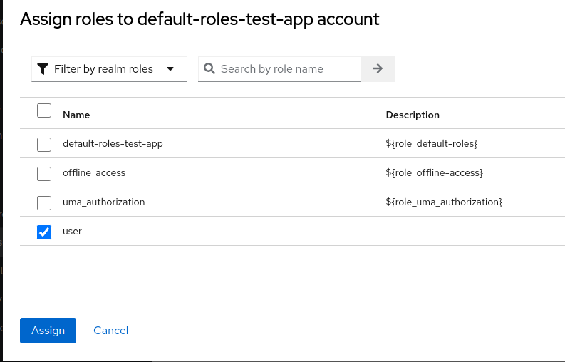

Now every user registered using our Angular frontend will be automatically assigned to role `user`.

### 2.7. Creating 'test' users
I call it `test user`, because this user is created 'artificially', we will add a registration process later.

1. Go to `Users -> Add user`
2. Fill in `Email` and check `Email verified`.<br/>
Make sure `Required user actions` field is empty that we can start using this account without any further adjustments (e.g. first time log in password change, email confirmation etc.). Click create.<br/>
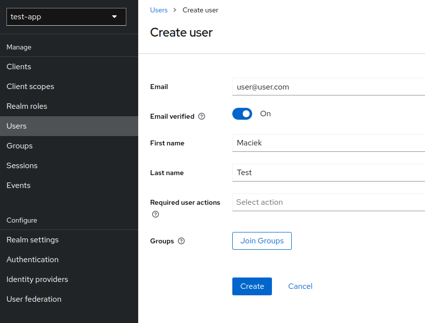
3. Go to `Users` and select newly create user.
Go to `Credentials tab` and add password by clicking `Set password`.<br/>
Make sure to uncheck `Temporary` and `Save`.<br/>
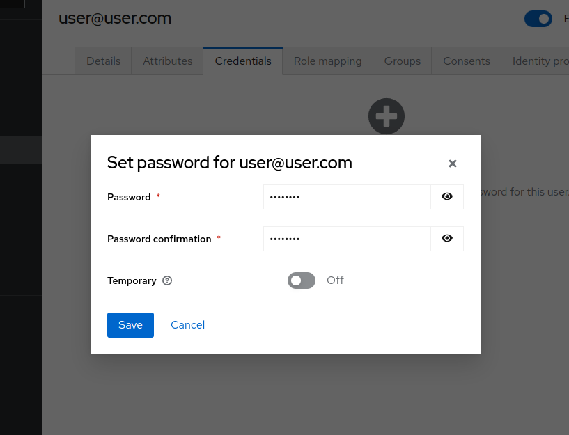
   
### 2.8. Adding roles to user
> This step is just to inform you, how to add role to user. We don't have to do that because our role `user` is automatically assigned for every user.

1. Go to `Users` and select newly create user.
2. Go to `Role mapping` tab
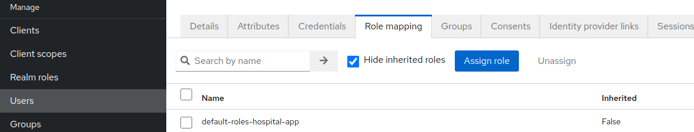
3. Click `Assign role`, choose your newly created role and hit `Assign`
(here some random created role `teacher`)
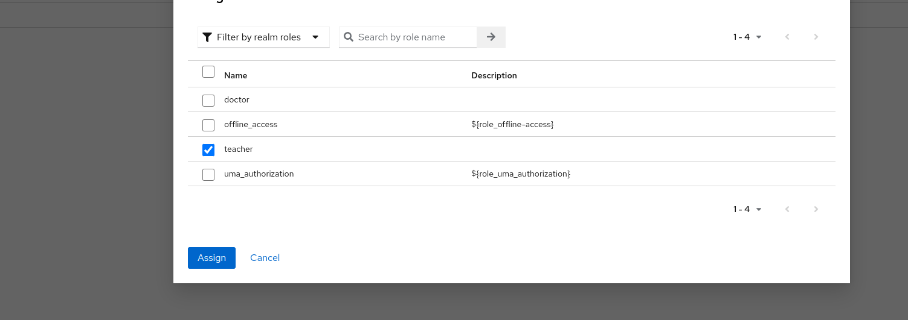


## 3. Spring Boot - configuration

### 3.1. Maven thing - *pom.xml*
We just need basci stuff (postgres, lombok and spring).<br/><br/>
*pom.xml*
```xml
<?xml version="1.0" encoding="UTF-8"?>
<project xmlns="http://maven.apache.org/POM/4.0.0" xmlns:xsi="http://www.w3.org/2001/XMLSchema-instance"
         xsi:schemaLocation="http://maven.apache.org/POM/4.0.0 https://maven.apache.org/xsd/maven-4.0.0.xsd">
    <modelVersion>4.0.0</modelVersion>
    <parent>
        <groupId>org.springframework.boot</groupId>
        <artifactId>spring-boot-starter-parent</artifactId>
        <version>2.7.5</version>
        <relativePath/> <!-- lookup parent from repository -->
    </parent>
    <groupId>com.example</groupId>
    <artifactId>spring-app</artifactId>
    <version>0.0.1-SNAPSHOT</version>
    <name>spring-app</name>
    <description>spring-app</description>
    <properties>
        <java.version>11</java.version>
    </properties>
    <dependencies>
        <dependency>
            <groupId>org.springframework.boot</groupId>
            <artifactId>spring-boot-starter-data-jpa</artifactId>
        </dependency>
        <dependency>
            <groupId>org.springframework.boot</groupId>
            <artifactId>spring-boot-starter-security</artifactId>
        </dependency>
        <dependency>
            <groupId>org.springframework.boot</groupId>
            <artifactId>spring-boot-starter-validation</artifactId>
        </dependency>

        <dependency>
            <groupId>org.postgresql</groupId>
            <artifactId>postgresql</artifactId>
            <scope>runtime</scope>
        </dependency>
        <dependency>
            <groupId>org.projectlombok</groupId>
            <artifactId>lombok</artifactId>
            <optional>true</optional>
        </dependency>
        <dependency>
            <groupId>org.springframework.boot</groupId>
            <artifactId>spring-boot-starter-test</artifactId>
            <scope>test</scope>
        </dependency>
        <dependency>
            <groupId>org.springframework.security</groupId>
            <artifactId>spring-security-test</artifactId>
            <scope>test</scope>
        </dependency>
        <dependency>
            <groupId>org.springframework.boot</groupId>
            <artifactId>spring-boot-starter-web</artifactId>
        </dependency>

        <!-- Resource server -->
        <dependency>
            <groupId>org.springframework.boot</groupId>
            <artifactId>spring-boot-starter-oauth2-resource-server</artifactId>
        </dependency>
    </dependencies>

    <build>
        <plugins>
            <plugin>
                <groupId>org.springframework.boot</groupId>
                <artifactId>spring-boot-maven-plugin</artifactId>
                <configuration>
                    <excludes>
                        <exclude>
                            <groupId>org.projectlombok</groupId>
                            <artifactId>lombok</artifactId>
                        </exclude>
                    </excludes>
                </configuration>
            </plugin>
        </plugins>
    </build>

</project>
```

### 3.2. *application.properties*
*application.properties*
```yaml
# -- Spring Boot --
server.port=8080

# -- Postgresql database --
spring.datasource.url=jdbc:postgresql://localhost:5432/ewizitingDB
spring.datasource.username=admin
spring.datasource.password=admin
spring.jpa.hibernate.ddl-auto=create

# -- Keycloak --
spring.security.oauth2.resourceserver.jwt.issuer-uri=http://localhost:8081/realms/test-app
```

### 3.3. SecurityConfig.java

Basic spring security configuration.<br/>
- `jwtAuthenticationConverterForKeycloak` - maps Keycloak roles (REALM and CLIENT level) to get them all with user info. By default, spring doesn't retrieve realm? level roles.
- `http.anonymous().disable();` - disable anonymous requests (not logged in users).
- `http.authorizeRequests().anyRequest().hasRole("user");` - allow to use site only for logged users with role `user`.
- `jwtAuthUserFilterBean()`, `http.addFilterAfter(jwtAuthUserFilterBean(), SwitchUserFilter.class);` - in my case I need a 'brief' user database to be able to (create relation) link user with other table in Spring Boot e.g. users are teachers and I link them with classes. To be able to do that, i need `Users` table. For that matter, filter synchronizes logged user with Spring Boot user table.

*SecurityConfig.java*
```java
package com.example.springapp.security;

import lombok.RequiredArgsConstructor;
import lombok.extern.slf4j.Slf4j;
import org.springframework.context.annotation.Bean;
import org.springframework.context.annotation.Configuration;
import org.springframework.core.convert.converter.Converter;
import org.springframework.security.config.annotation.method.configuration.EnableGlobalMethodSecurity;
import org.springframework.security.config.annotation.web.builders.HttpSecurity;
import org.springframework.security.config.annotation.web.configuration.EnableWebSecurity;
import org.springframework.security.config.http.SessionCreationPolicy;
import org.springframework.security.core.GrantedAuthority;
import org.springframework.security.core.authority.SimpleGrantedAuthority;
import org.springframework.security.oauth2.jwt.Jwt;
import org.springframework.security.oauth2.server.resource.authentication.JwtAuthenticationConverter;
import org.springframework.security.web.SecurityFilterChain;
import org.springframework.security.web.authentication.switchuser.SwitchUserFilter;

import java.util.Collection;
import java.util.Map;
import java.util.stream.Collectors;

@Configuration
@EnableWebSecurity
@EnableGlobalMethodSecurity(prePostEnabled = true)
@RequiredArgsConstructor
@Slf4j
public class SecurityConfig {

    /**
     * Map Keycloak roles (REALM and CLIENT level) to get them all
     * */
    @Bean
    public JwtAuthenticationConverter jwtAuthenticationConverterForKeycloak() {

        log.warn("CONVERT");

        Converter<Jwt, Collection<GrantedAuthority>> jwtGrantedAuthoritiesConverter = jwt -> {
            Map<String, Collection<String>> realmAccess = jwt.getClaim("realm_access");
            Collection<String> roles = realmAccess.get("roles");
            return roles.stream()
                    .map(role -> new SimpleGrantedAuthority("ROLE_" + role))
                    .collect(Collectors.toList());
        };

        var jwtAuthenticationConverter = new JwtAuthenticationConverter();
        jwtAuthenticationConverter.setJwtGrantedAuthoritiesConverter(jwtGrantedAuthoritiesConverter);

        return jwtAuthenticationConverter;
    }

    /**
     * Sync local minimal user database with Keycloak db
     * */
    @Bean
    public JwtUserSyncFilter jwtAuthUserFilterBean() {
        return new JwtUserSyncFilter();
    }

    /**
     * Configure security
     * */
    @Bean
    public SecurityFilterChain configure(HttpSecurity http) throws Exception {
        http.csrf().disable();
        http.cors().disable();
        http.anonymous().disable();

        http.sessionManagement().sessionCreationPolicy(SessionCreationPolicy.STATELESS);
        http.oauth2ResourceServer().jwt().jwtAuthenticationConverter(jwtAuthenticationConverterForKeycloak());

        http.authorizeRequests()
                .anyRequest()
                    .hasRole("user");

        http.addFilterAfter(jwtAuthUserFilterBean(), SwitchUserFilter.class);

        return http.build();
    }

}
```

### 3.4. User.java - `User` table
Stores basic user info retrieved from token.<br/>
*User.java*
```java
package com.example.springapp.entity;

import lombok.*;
import javax.persistence.*;

@Entity
@Table(name = "USER_")
@Setter @Getter
@Builder
@AllArgsConstructor
@NoArgsConstructor
public class User {

    @Id
    @Column
    private String email;

    @Column
    private String firstname;

    @Column
    private String lastname;

    @Column
    @Enumerated(EnumType.STRING)
    private Gender gender;
    
    public enum Gender {
        MALE, FEMALE
    }

}
```

### 3.5. UserService.java
Manages `User` table.<br>

*UserService.java*
```java
package com.example.springapp.service;

import com.example.springapp.entity.User;
import com.example.springapp.repository.UserRepository;
import lombok.RequiredArgsConstructor;
import org.springframework.security.core.context.SecurityContextHolder;
import org.springframework.security.oauth2.server.resource.authentication.JwtAuthenticationToken;
import org.springframework.stereotype.Service;

import javax.persistence.EntityNotFoundException;
import java.util.Optional;

@Service
@RequiredArgsConstructor
public class UserService {

    private final UserRepository userRepository;

    public User getLoggedUser() {
        JwtAuthenticationToken token = (JwtAuthenticationToken) SecurityContextHolder.getContext().getAuthentication();

        String email = String.valueOf(token.getTokenAttributes().get("email"));
        User user = userRepository.findByEmail(email).orElseThrow(() -> new EntityNotFoundException("Error while fetching user"));

        return user;
    }

    public void syncUser(User user) {
        if (user == null) {
            throw new EntityNotFoundException("Error while user sync");
        }

        User saveUser = user;
        Optional<User> optionalUser = userRepository.findByEmail(user.getEmail());

        if (optionalUser.isPresent()) {
            saveUser = optionalUser.get();
            saveUser.setFirstname(user.getFirstname());
            saveUser.setLastname(user.getLastname());
        }

        userRepository.save(saveUser);
    }

}
```

### 3.6. JwtUserSyncFilter.java
Retrieve data from token and sync local user table.<br/>

*JwtUserSyncFilter.java*
```java
package com.example.springapp.security;

import com.example.springapp.entity.User;
import com.example.springapp.service.UserService;
import org.springframework.beans.factory.annotation.Autowired;
import org.springframework.security.core.context.SecurityContextHolder;
import org.springframework.security.oauth2.server.resource.authentication.JwtAuthenticationToken;
import org.springframework.web.filter.OncePerRequestFilter;

import javax.servlet.FilterChain;
import javax.servlet.ServletException;
import javax.servlet.http.HttpServletRequest;
import javax.servlet.http.HttpServletResponse;
import java.io.IOException;


public class JwtUserSyncFilter extends OncePerRequestFilter {

  @Autowired
  private UserService userService;

  @Override
  protected void doFilterInternal(HttpServletRequest request, HttpServletResponse response, FilterChain filterChain) throws ServletException, IOException {

    try {
      JwtAuthenticationToken token = (JwtAuthenticationToken) SecurityContextHolder.getContext().getAuthentication();

      String firstname = String.valueOf(token.getTokenAttributes().get("given_name"));
      String lastname = String.valueOf(token.getTokenAttributes().get("family_name"));
      String email = String.valueOf(token.getTokenAttributes().get("email"));
      User.Gender gender = token.getTokenAttributes().get("gender") == null ? null :
              User.Gender.valueOf(String.valueOf(token.getTokenAttributes().get("gender")).toUpperCase());

      User user = User.builder()
              .firstname(firstname)
              .lastname(lastname)
              .email(email)
              .gender(gender)
              .build();

      userService.syncUser(user);
    } catch (Exception e) {
      throw new IllegalArgumentException("Unable to auth user");
    }

    filterChain.doFilter(request, response);
  }

}
```

### 3.7. WebController.java
Controller for demonstration purposes.
- `getUserInfo1()` - gets user info from synced `User` Spring Boot database
- `getUserInfo2()` - gets user info directly from the token
> We need to add `@CrossOrigin(origins = "http://localhost:4200")` to be able to use endpoint from Angular frontend.

*WebController.java*
```java
package com.example.springapp.controller;

import com.example.springapp.entity.User;
import com.example.springapp.service.UserService;
import lombok.RequiredArgsConstructor;
import org.slf4j.Logger;
import org.slf4j.LoggerFactory;
import org.springframework.security.oauth2.server.resource.authentication.JwtAuthenticationToken;
import org.springframework.web.bind.annotation.CrossOrigin;
import org.springframework.web.bind.annotation.GetMapping;
import org.springframework.web.bind.annotation.RestController;


@RestController
@CrossOrigin(origins = "http://localhost:4200")
@RequiredArgsConstructor
public class WebController {

    private static final Logger logger = LoggerFactory.getLogger(WebController.class);

    private final UserService userService;

    @GetMapping(path = "/userInfo1")
    public String getUserInfo1() {
        User user = userService.getLoggedUser();

        return "UserInfo1: " + user.getFirstname() + " " + user.getLastname() + ", " + user.getEmail();
    }

    @GetMapping("/userInfo2")
    public String getUserInfo2(JwtAuthenticationToken auth) {
        String firstname = auth.getTokenAttributes().get("given_name").toString();
        String lastname = auth.getTokenAttributes().get("family_name").toString();
        String email = auth.getTokenAttributes().get("email").toString();
        String authorities = auth.getAuthorities().toString();

        return "UserInfo2: " + firstname + " " + lastname + ", " + email + ", " + authorities ;
    }

}
```

## 4. Angular - configuration

### 4.0. Open your Angular project or create new
Create new project using:

```
ng new angular-app
```

While creating project make sure you use routing.

### 4.1. Install dependencies
```
npm install keycloak-angular --save 
npm install keycloak-js --save
```

### 4.2. Configure proxy to avoid any CORS policy
Every call made to `http://localhost:4200/api`, will be redirected to our Spring Boot application `http:localhost:8080`.

1. Create file `proxy.conf.json` inside project directory
```json
{
  "/api": {
    "target": "http://localhost:8080",
    "secure": false,
    "pathRewrite": {"^/api" : ""}
  }
}
```

2. Edit `package.json` (or start script using this command by hand)
```
"start": "ng serve --proxy-config proxy.conf.json",
```

### 4.3. Config Keycloak using `enviroment`
Update enviroment file.

*src/enviroments/enviroment.ts*
```typescript
export const environment = {
  production: false,
  apiUrl: '/api',
  keycloak: {
    // Keycloak url
    issuer: 'http://localhost:8081',
    // Realm
    realm: 'test-app',
    clientId: 'frontend'
  },
};
```

### 4.4. Initialize Keycloak service
In order to make sure Keycloak is initialized you will have to add an APP_INITIALIZER provider to your AppModule.
This provider will call the initializeKeycloak function shown below which will set up the Keycloak service.

1. Create folder and file *utils/app-init.ts*

*utils/app-init.ts*
```typescript
import { KeycloakService } from "keycloak-angular";
import { environment } from "../environments/environment";

export function initializer(keycloak: KeycloakService): () => Promise<any> {
  return (): Promise<any> => {
    return new Promise(async (resolve, reject) => {
      try {
        await keycloak.init({
          config: {
            url: environment.keycloak.issuer,
            realm: environment.keycloak.realm,
            clientId: environment.keycloak.clientId,
          },
          // If set a false you cannot get any information about the user (e.g. username)
          loadUserProfileAtStartUp: true,
          initOptions: {
            onLoad: 'login-required',
            checkLoginIframe: true,
            // silentCheckSsoRedirectUri: window.location.origin + '/assets/silent-check-sso.html',
          },
          // By default, the keycloak-angular library add 'Authorization: Bearer TOKEN' header to all http requests
          // Add here if u want to exclude urls (to not have that header)
          bearerExcludedUrls: ['/assets']
        });

        resolve(resolve);
      } catch (err) {
        reject(err);
      }
    });
  };

}
```

2. Update *src/app/app.module.ts*

*app.module.ts*
```typescript
import {APP_INITIALIZER, NgModule} from '@angular/core';
import { BrowserModule } from '@angular/platform-browser';

import { AppComponent } from './app.component';
import {initializer} from "../utils/app-init";
import {KeycloakAngularModule, KeycloakService} from "keycloak-angular";
import { AppRoutingModule } from './app-routing.module';
import { AccessDeniedComponent } from './access-denied/access-denied.component';
import { UserInfoComponent } from './user-info/user-info.component';
import {HttpClientModule} from "@angular/common/http";

@NgModule({
  declarations: [
    AppComponent,
    AccessDeniedComponent,
    UserInfoComponent
  ],
  imports: [
    BrowserModule,
    AppRoutingModule,
    KeycloakAngularModule,
    HttpClientModule
  ],
  providers: [
    {
      provide: APP_INITIALIZER,
      useFactory: initializer,
      deps: [ KeycloakService ],
      multi: true
    }
  ],
  bootstrap: [AppComponent]
})
export class AppModule { }
```

### 4.5. Protect pages using guard
In order to make some pages available for logged users with enough roles, we will create guard and service for authorization purposes.<br/>
Create folder *src/app/auth*.

*src/app/auth/auth.guard.ts*
```typescript
import {Injectable} from "@angular/core";
import {ActivatedRouteSnapshot, Router, RouterStateSnapshot} from "@angular/router";
import {KeycloakAuthGuard, KeycloakService} from "keycloak-angular";
import Keycloak from "keycloak-js";

@Injectable({
  providedIn: 'root'
})
export class AuthGuard extends KeycloakAuthGuard {

  constructor(protected override readonly router: Router,
              protected readonly keycloak: KeycloakService
  ) {
    super(router, keycloak);
  }

  public async isAccessAllowed(route: ActivatedRouteSnapshot, state: RouterStateSnapshot) {

    // If not logged, redirect to login page
    if (!this.authenticated) {
      await this.keycloak.login({
        redirectUri: window.location.origin + state.url
      });
    }

    // Get the roles from keycloak
    const keycloakRoles = this.roles;

    // Get the roles from app.routing.module.ts
    const requiredRoles = route.data['roles'];

    // If page doesn't need any extra roles
    if (!(requiredRoles instanceof Array) || requiredRoles.length == 0) {
      return true;
    }

    // Check whether user has role to visit page (check keycloak roles against app.routing.module.ts config)
    if (requiredRoles.every(role => keycloakRoles.includes(role))) {
      return true;
    }

    // If user doesn't have necessary roles, redirect to error page
    this.router.navigate(['access-denied']);
    return false;
  }

}
```

*src/app/auth/auth.service.ts*
```typescript
import {Injectable} from "@angular/core";
import {KeycloakService} from "keycloak-angular";

@Injectable({
  providedIn: "root"
})
export class  AuthService {

  constructor(private keycloakService: KeycloakService) { }

  public getUsername(): string {
    return this.keycloakService.getUsername();
  }

  public logout(): void {
    this.keycloakService.logout().then(() => this.keycloakService.clearToken());
  }

}
```

### 4.6. Create and configure pages (components)
1. Create page for `access-denied` purposes.
```
ng g c access-denied
````

2. Create page for `user-info`.
```
ng g c user-info
````

3. Update *src/app/user-info/user-info.component.ts*

*user-info.component.ts*
```typescript
import { Component, OnInit } from '@angular/core';
import {HttpClient} from "@angular/common/http";
import {AuthService} from "../auth/auth.service";
import {WebApiService} from "../api/web-api.service";

@Component({
  selector: 'app-user-info',
  templateUrl: './user-info.component.html',
  styleUrls: ['./user-info.component.css']
})
export class UserInfoComponent implements OnInit {

  message: string = 'null';

  constructor(private authService: AuthService, private webApiService: WebApiService, private http: HttpClient) { }

  ngOnInit(): void {
    this.message = this.authService.getUsername();

    this.webApiService.getUserInfo().subscribe({
      next: data => {
        this.message += ", " + data;
      }, error: err => {
        console.log(err);
      }
    });

  }

}
```
4. Update *src/app/user-info/user-info.component.html*

*user-info.component.html*
```html
<p>Username: {{ message }}</p>
```

### 4.7. Configure which pages should be protected
Update *src/app/app-routing.module.ts*.<br/>

*app-routing.module.ts*
```typescript
import { NgModule } from '@angular/core';
import { CommonModule } from '@angular/common';
import {RouterModule, Routes} from "@angular/router";
import {AccessDeniedComponent} from "./access-denied/access-denied.component";
import {AuthGuard} from "./auth/auth.guard";
import {UserInfoComponent} from "./user-info/user-info.component";

const routes: Routes = [
  {
    path: 'access-denied',
    component: AccessDeniedComponent,
    canActivate: [AuthGuard]
  },
  {
    path: 'user-info',
    component: UserInfoComponent,
    canActivate: [AuthGuard],
    // The user need to have these roles to access page
    data: { roles: ['user'] }
  }
];

@NgModule({
  imports: [RouterModule.forRoot(routes)],
  exports: [RouterModule]
})
export class AppRoutingModule { }
```

### 4.8. Update main page to show load components
Update *src/app/app.component.ts* and *src/app/app.component.html*.<br/>

*app.component.ts*
```typescript
import { Component } from '@angular/core';
import {AuthService} from "./auth/auth.service";

@Component({
  selector: 'app-root',
  templateUrl: './app.component.html',
  styleUrls: ['./app.component.css']
})
export class AppComponent {
  title = 'angular-app';

  constructor(private authService: AuthService) {
  }

  public logout() {
    this.authService.logout();
  }

}
```

*app.component.html*
```html
<button routerLink="user-info">Request UserInfo</button>
<button (click)="logout()">logout</button>
<router-outlet></router-outlet>
```

## 5. That's it
Start Spring Boot and Angular. Go to http://localhost:4200 and you sould see Keycloak login/register page.
